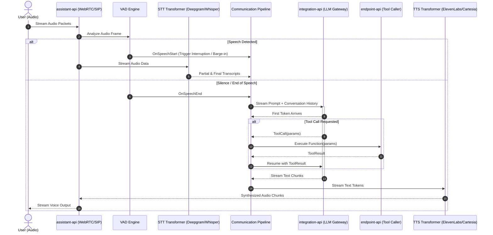

# Architecture & System Design

## 1. High-Level Architecture Overview

Rapida Voice AI is architected as a distributed, event-driven microservices platform. High-frequency bidirectional audio streaming is handled via binary gRPC and WebRTC/SIP, while control plane operations, administrative tooling, and metadata are served via REST and gRPC-web through a single unified ingress.

```
                         [ Browser / Phone / WebRTC / SIP Trunk ]
                                            |
                                            v
                         +--------------------------------------+
                         |          Nginx Reverse Proxy         |
                         |               (Port 8080)            |
                         +--------------------------------------+
                                            |
         +------------------+---------------+------------------+------------------+
         | (UI HTTP/WS)     | (REST/gRPC-web)                  | (gRPC Direct)    | (SIP Audio)
         v                  v                                  v                  v
+------------------+ +--------------+                  +---------------+  +---------------+
|     ui (React)   | |   web-api    |                  | assistant-api |  | assistant-api |
|   (Port 3000)    | | (Port 9001)  |                  |  (Port 9007)  |  |  (Port 4573)  |
+------------------+ +--------------+                  +---------------+  +---------------+
                            |                                  |
                            |                          +-------+-------+
                            v                          v               v
                     +--------------+         +-----------------+ +---------------+
                     |  PostgreSQL  |         | integration-api | | endpoint-api  |
                     | (Port 5432)  |         |   (Port 9004)   | |  (Port 9005)  |
                     +--------------+         +-----------------+ +---------------+
                            ^                          |                   |
                            |                          v                   v
                     +--------------+         +-----------------+         ...
                     |   Redis 7    |         | LLM Providers   |
                     | (Port 6379)  |         | (Anthropic/OAI) |
                     +--------------+         +-----------------+
                            ^
                            |
                     +--------------+         +-----------------+
                     |  OpenSearch  |<--------|  document-api   |
                     | (Port 9200)  |         | (Python - 9010) |
                     +--------------+         +-----------------+
```

---

## 2. Microservices Inventory

| Service | Primary Port | Protocol | Language / Runtime | Core Responsibility |
| :--- | :--- | :--- | :--- | :--- |
| **`assistant-api`** | `9007` (API)<br>`4573` (SIP) | gRPC / REST / WebRTC / SIP | Go 1.25 | Orchestrates the real-time voice loop. Houses audio transformers (STT, TTS), VAD, turn detection, call state machine, and telephony channels. |
| **`web-api`** | `9001` | gRPC / REST (Gin) | Go 1.25 | Authentication, OAuth2 connectors, organization hierarchy, project workspaces, encrypted credential vaults, and proxy gateway. |
| **`integration-api`**| `9004` | gRPC | Go 1.25 | Standardized LLM execution layer. Bridges to OpenAI, Anthropic, Gemini, Groq, and custom inference backends. |
| **`endpoint-api`** | `9005` | gRPC / REST | Go 1.25 | Invokes dynamic function tools, external webhooks, request rate limiting, response caching, and circuit breakers. |
| **`document-api`** | `9010` | REST / Celery | Python 3.11 (FastAPI) | Document parsing (PDF/Docs), text chunking, embedding generation, and vector indexing into OpenSearch. |
| **`ui`** | `3000` | HTTP / WebSocket | React 18, TypeScript, Tailwind | Production dashboard, assistant configuration studio, live session visualizer, audio playback, and analytics. |

---

## 3. Communication & Multiplexing Design

### 3.1 Protocol Multiplexing (`cmux`)
Every Go microservice binds to a single port and leverages `soheilhy/cmux` to multiplex incoming traffic:
- **HTTP/2 (Prioritized gRPC)**: Inter-service communication via generated protobuf stubs.
- **gRPC-Web**: Enables direct typed browser RPC calls from the React UI.
- **HTTP/1.1 (Gin REST)**: Public `/v1/*` endpoints for developer APIs and webhooks.

### 3.2 Inter-Service Calling Pattern
- **Strict Rule**: Microservices **never** communicate over HTTP with each other.
- **Typed Clients**: All service-to-service calls use typed gRPC clients residing in `pkg/clients/`.
- **Context Propagation**: Every gRPC call propagates distributed trace metadata, tenant context (`organization_id`, `project_id`), and authentication tokens via gRPC metadata interceptors.

---

## 4. End-to-End Real-Time Voice Lifecycle



---

## 5. Storage & Persistence Tier

- **PostgreSQL 15 (`5432`)**:
  - Authoritative relational store.
  - Entities compose GORM base schemas: `Audited` (UUID/Snowflake ID, timestamps), `Mutable` (state, updater), and `Organizational` (tenant tenancy).
  - Versioned migration files located in each service under `api/<service>/migrations/`.
- **Redis 7 (`6379`)**:
  - Low-latency cache, second-level query cache for GORM, distributed locking, and event pub/sub.
- **OpenSearch 2.11 (`9200`)**:
  - Tenant-isolated vector indexes storing document embeddings and BM25 text indices for context retrieval (RAG).

---

## 6. Repository Layout & File Organization

```
voice-ai-main/
├── api/                           # Microservice implementations
│   ├── assistant-api/             # Real-time voice pipeline & transformers
│   │   ├── internal/channel/      # WebRTC, SIP, and WebSocket transports
│   │   ├── internal/service/      # Business logic & gRPC implementations
│   │   └── internal/transformer/  # STT / TTS provider integrations
│   ├── document-api/              # Python FastAPI & Celery document service
│   ├── endpoint-api/              # Function calling & webhook executor
│   ├── integration-api/           # Unified LLM provider gateway
│   └── web-api/                   # Auth, organizations, vaults, projects
├── cmd/                           # Service main entry points
│   ├── assistant/assistant.go
│   ├── endpoint/endpoint.go
│   ├── integration/integration.go
│   └── web/web.go
├── config/                        # Global AppConfig & shared Viper schemas
├── docker/                        # Containerfiles and service environment files
├── pkg/                           # Reusable internal packages
│   ├── clients/                   # Typed gRPC clients for inter-service calls
│   ├── commons/                   # Loggers, errors, Snowflake generators
│   └── connect/                   # Postgres, Redis, OpenSearch connection pools
├── protos/                        # Generated protobuf stubs (Go)
│   └── artifacts/                 # Source .proto definitions (git submodule)
├── rfcs/                          # Governed RFC proposals & decision records
├── tests/                         # End-to-end integration test suites
└── ui/                            # React 18 + TypeScript + Tailwind frontend
    ├── src/components/            # UI components & visualizers
    ├── src/pages/                 # Route views & workflows
    ├── src/providers/             # Model/Voice metadata JSON schemas
    └── src/styles/                # Tailwind CSS & theme tokens
```
